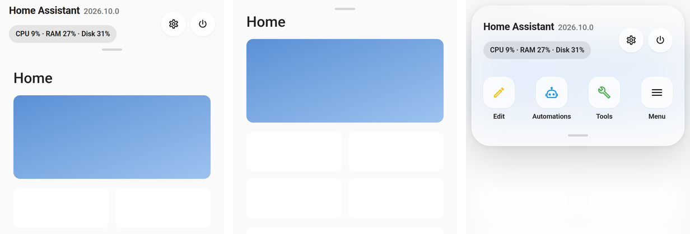

# Origami Header

Replaces the Home Assistant dashboard header. Build your own header from cards, hide the header and keep its controls in a drawer that slides down, or do both.



## Why

You can hide the header with kiosk-mode or a theme, but two things get lost on the way. The header still shows for a moment while the dashboard loads, and once it is gone there is no direct way into edit mode or the sidebar.

Origami Header takes the header's place while the dashboard renders, so nothing flashes. What goes there is up to you: cards that form a new header, a drawer with shortcuts and cards behind a small handle, or a header that opens the drawer.

Everything is set up with a regular card in the dashboard editor. The card is invisible on the dashboard, previews the result in edit mode and in the card editor, and changes apply when you save.

## Installation

Add this repository to HACS as a custom repository with the type Dashboard and download Origami Header. Then load it as an extra module in `configuration.yaml` and restart Home Assistant:

```yaml
frontend:
  extra_module_url:
    - /hacsfiles/origami-header/origami-header.js
```

The module has to run before the dashboard renders. As a dashboard resource it would load too late. If HACS added such a resource anyway, you can leave it. The module starts only once.

<details>
<summary>Manual installation</summary>

Download `origami-header.js` from the latest release into `config/www`, use `/local/origami-header.js?v=1.0.0` as the extra module URL and restart. Change the version in the URL after each update, otherwise browsers keep the old file.

</details>

## Usage

Edit the dashboard, add the Origami Header card to any view and choose a mode:

| Mode | Header | Drawer |
| --- | --- | --- |
| `drawer` (default) | Hidden | Opens from a handle at the top of the screen |
| `header` | Your header cards, visible to everyone | Opens from a handle under the header |
| `hidden` | Hidden | None |

Tap the handle or pull it down to open the drawer. Tap outside, press Escape or push the grip at its edge back to close it.

To open the drawer from a card instead, for example from a button in a navigation bar or in your header cards, use this action. `open` and `close` work as well:

```yaml
tap_action:
  action: fire-dom-event
  origami_header: toggle
```

<details>
<summary>Header example</summary>

A header with a title and a temperature badge, and the default shortcuts in the drawer:

```yaml
type: custom:origami-header-card
mode: header
header:
  - type: heading
    heading: Home
    heading_style: title
    badges:
      - type: entity
        entity: sensor.outdoor_temperature
```

Set `items: []` for a header without a drawer.

</details>

<details>
<summary>Options</summary>

All options are available in the visual editor.

| Option | Default | Description |
| --- | --- | --- |
| `mode` | `drawer` | `drawer`, `header` or `hidden` |
| `header` | | Cards that form the header in header mode. Without them the dashboard title is shown. |
| `cards` | | Cards at the top of the drawer |
| `items` | eight shortcuts | Shortcuts in the drawer. An empty list and no cards means no drawer. |
| `position` | `top` | Where the drawer comes from, `top` or `bottom` |
| `layout` | `list` | Shortcut layout, `list`, `grid` or `icons` |
| `all_users` | `false` | Let everyone open the drawer. Otherwise only admins can, and in drawer mode other users see no header. |
| `hide_handle` | `false` | Hide the handle and open the drawer from your own button |
| `css` | | Custom styles, see Styling below |

</details>

<details>
<summary>Shortcuts</summary>

A shortcut has a `label`, an `icon` and an action. Use `tap_action` for any Home Assistant action, or `special` for the two things a card action cannot do: `edit` turns on edit mode and `sidebar` opens the sidebar.

```yaml
items:
  - label: Edit
    icon: mdi:pencil-outline
    special: edit
  - label: Automations
    icon: mdi:robot-outline
    tap_action:
      action: navigate
      navigation_path: /config/automation/dashboard
```

</details>

<details>
<summary>Styling</summary>

`css` is applied inside the card, so you can target its parts directly:

| Class | Element |
| --- | --- |
| `.bar`, `.bar-cards`, `.title` | The header, its cards and the title shown without cards |
| `.handle` | Handle that opens the drawer |
| `.scrim` | Backdrop behind the drawer |
| `.sheet` | The drawer |
| `.cards`, `.grid` | Containers for the drawer cards and shortcuts |
| `.tile`, `.tile ha-icon`, `.label` | A shortcut, its icon and its label |
| `.grip` | Grip at the edge of the drawer |

```yaml
css: |
  .sheet { border-radius: 0 0 28px 28px; }
  .scrim { backdrop-filter: blur(12px); }
```

The screenshot uses [examples/header.yaml](examples/header.yaml) and [examples/control-center.yaml](examples/control-center.yaml). Their top row needs [paper-buttons-row](https://github.com/jcwillox/lovelace-paper-buttons-row) and the System Monitor integration.

</details>

<details>
<summary>How it works</summary>

`hui-root` renders the dashboard header inside a slot named `toolbar`. The module patches `hui-root` so that every render puts its own element into that slot before the browser paints. Hiding the header after it has been drawn is what causes the flash in other approaches.

In header mode the header keeps its theme background, and the view starts below it because the module sets `--header-height` to the height of your header cards.

The configuration card marks itself as hidden outside edit mode, so Home Assistant leaves it out of the layout like any hidden card. In edit mode and in the card editor Home Assistant switches the card to preview, and it renders the header and drawer in place.

This depends on Home Assistant internals. If an update removes the slot, the module logs a warning and leaves the default header alone.

</details>

## Compatibility

Tested with Home Assistant 2026.9. In edit mode the default header is shown, so the dashboard tools keep working.

## License

MIT
